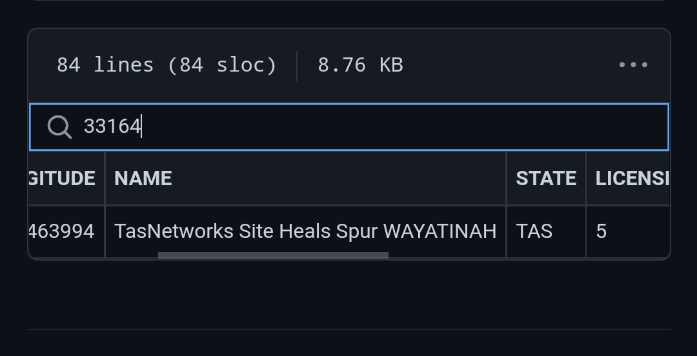
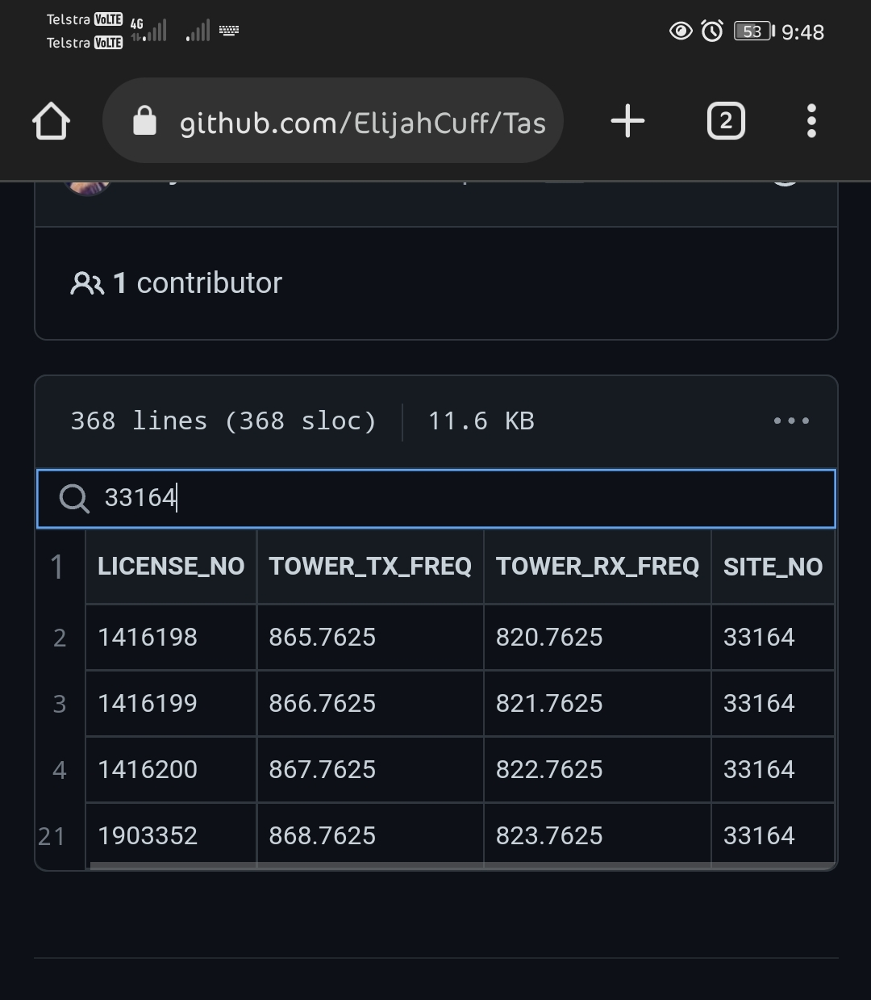

# **800**MHz to **1000**Mhz project.
----
> This project aims to provide resources for verifying the frequencies on [Radio Reference ](https://RadioReference.com), In many cases the information may be outdated in your area, for example I needed to request an update to the Mt Horror repeater, as the information was several years old.
 
>  Information can be verified by checking the repeaters registered frequency assignments at the A.C.M.A ( Australian Communications And Media Authority ). 

Transmitters     
[Client 220486](https://web.acma.gov.au/rrl/site_proximity.for_client?pCLIENT_NO=220486)    
Freq's    
[800Mhz registrations.](https://web.acma.gov.au/rrl/pkg_800mhz_search.results_page?pSEARCH_TYPE=Client%20No.&pQRY=220486)    
  
 Rather than create a whole new list exactly the same as Radio Reference, I decided to download the CSV lists for both site information and 800 to 1000 megahertz frequencies, unfortunately this was a cumbersome task trying to get the frequencies that are displayed on Radio Reference ( This means not including anything above 1Ghz and below 800Mhz )
  
##  **The Lists**
----
1. transmitters.csv
2. frequencies.csv
 
 
 

> The two CSV's need to be used together to locate the exact frequencies for each repeater.
 
 transmitters.csv will show you the repeaters name, and importantly the SITE Number.
  
  Once obtaining the Site Number, You need to look through all the registered frequencies and locate the ones associated with the site no' - An easy task for an application, script or software to perform.  
  
 Example,  
### _transmitters.csv_
**SITE_NO**`, LATITUDE, LONGITUDE, NAME,STATE,LICENSING_AREA_ID,POSTCODE,SITE_PRECISION,ELEVATION,HCIS_L2, CHANNELS`

**33164**`,-42.412421,146.463994,TasNetworks Site Heals Spur WAYATINAH,TAS,5,7140,Within 10 metres,684,LY8F,60`
   
```
32899,-42.832041,147.223933,TasNetworks - Site GOAT HILLS GOAT HILLS,TAS,4,7012,Within 10 metres,594,LY9M,84
32946,-42.866061,147.457558,TasNetworks - Site Guy Fawkes Hill GUY FAWKES HILL,TAS,4,7170,Within 10 metres,329,LY9N,62
32982,-42.018302,146.75519,Tasmania Fire Service Site BARREN TIER,TAS,4,7030,Within 10 metres,1182,LY8D,28
33123,-42.367848,147.471248,TasNetworks site Mt Seymour OATLANDS,TAS,4,7120,Within 10 metres,739,LY9F,44
33147,-42.774729,146.071029,TasNetworks Site Twelve Trees Range STRATHGORDON,TAS,5,7139,Within 10 metres,663,LY8M,16
33160,-42.716104,146.46609,TasNetworks Site MT Tim Shea MAYDENA,TAS,5,7140,Within 10 metres,903,LY8J,28
33163,-42.775274,146.654628,TasNetworks Site Abbotts Lookout MAYDENA,TAS,5,7140,Within 10 metres,1059,LY8O,26

```

###      _frequencies.csv_  
 `LICENSE_NO,`**TOWER_TX_FREQ**`,TOWER_RX_FREQ,`**SITE_NO**   

 `1416199,`**866.7625**`,821.7625,`**33164**
 
```
1416202,866.8375,821.8375,33951
1416203,867.8375,822.8375,33951
1416204,865.4625,820.4625,34270
1416205,866.4625,821.4625,34270
1416206,867.4625,822.4625,34270
1416660,865.3375,820.3375,402275
1416661,866.3375,821.3375,402275
1416662,867.3375,822.3375,402275
1416663,865.1625,820.1625,402276
1416664,866.1625,821.1625,402276
```
 
 The tower TX Frequency is the frequency that the repeater will broadcast out to handsets and radio devices while the RX Frequency is the frequency that the Handset will Broadcast Out to the Repeater.
 
In this example, to output a broadcast on channel 866.7625 we would need to Transmit a signal to channel 821.7625.
  
 With a scanner, we are only interested in the repeaters TX transmitter signals, not the RX receiver signals ( unless locating a Radio Device by it's output transmitting signal ).
  
Trunking changes the channels randomly to allow multiple people to communicate simultaneously.
 
 
  
  
  


