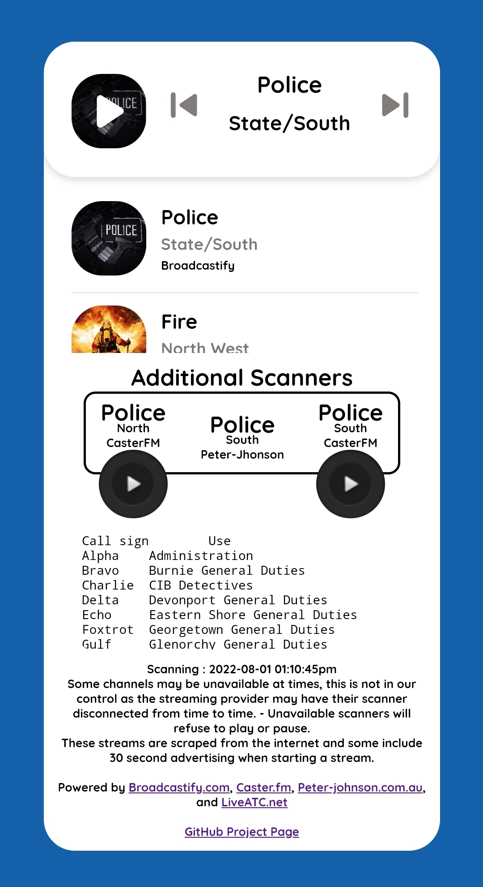
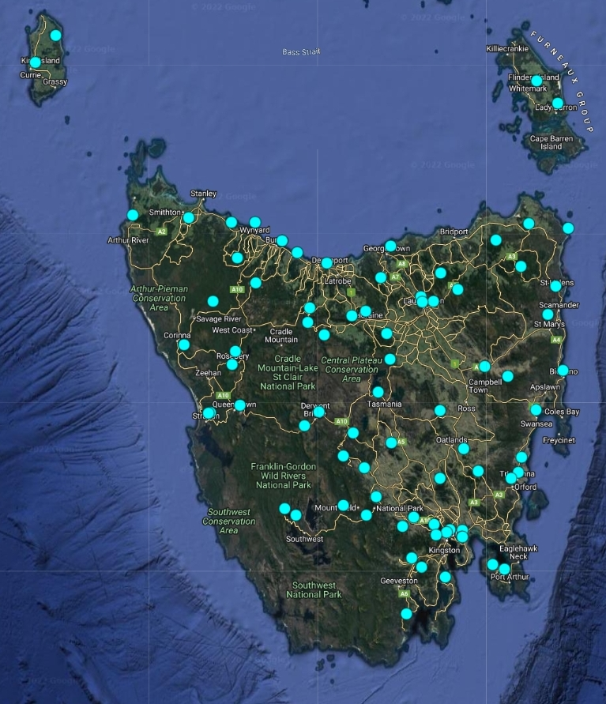

# Tas GRN Collection
Tasmania Australia, Government Radio Network Collection.    
- This project aims to shed light on serious concerns around the Tasmanian Police ( TasPol ) government radio network, most notably that the system is usually covered in it's entirety online through various citizens supplying live scanner feeds directly to the internet.    
- Tas GRN uses an extremely old method of Edacs Trunking, analogue audio is sent over various switching channels in the 800Mhz range, rarely do they use digital audio or encryption.   
- The government initiative to improve the security of the Tas GRN is at a massive cost to the tax payers, several million dollars in handset upgrades are needed, they estimate each secure handset to cost around $1000 and the entire network will not be secure until an estimated 10 years,  possibly never.    
  
Reference,.  
"Telstra awarded $567m TasGRN contract" - https://www.criticalcomms.com.au/content/public-safety/article/telstra-awarded-567m-tasgrn-contract-221547304
   
   
  

> I have compiled the direct audio streams to many Tas GRN Networks found hosted on various websites into a simple list and website alongside useful information on police and military operations.    
    
### Radio Networks Included,      
- Fire North
- Fire & Ambulance South   
- Police North   
- Police South   
- Airport North
- Airport South   

   
### Website's,        
      

- Version 1 ( HTML ) Website   
- Version 3 ( PHP ) PHPWebsite     
( http://scanner.ga )
   
### Useful Materials,   
- Information Operations.   
- Communication Operations.   
- Procedure Operations.   
- Evasion Resources.    
- Survival Resources.  
- Universal Police TGID ( Talk Group Identification ) numbers.   

    
         

Radio Reference is often incorrect and outdated, therefore you should check the frequencies via the ACMA Radio Register's website, 
Tasmania Police Client Number = 220486

Repeaters & Channel Assignments,
https://web.acma.gov.au/rrl/site_proximity.for_client?pCLIENT_NO=220486 
