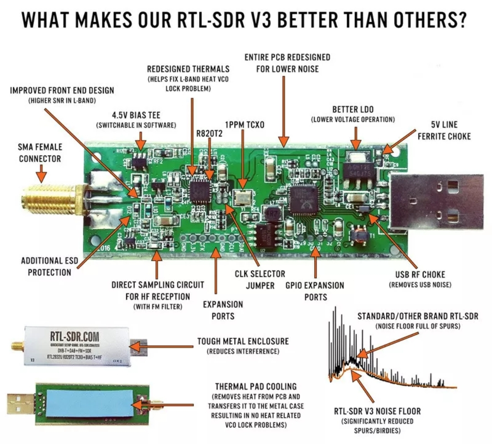

## RTL-SDR Resources.  
> Hacking a TV Dongle to become a police scanner or ADSB drone tracker.
---
   
Don't be fooled, you don't need a crystal oscillator - it just helps keep the parts per million down to around 1ppm.
   
I used a $14 RTL2832U and it works fine, just need to set at 28ppm.

[YouTube Information Link](https://m.youtube.com/results?sp=mAEA&search_query=Rtl+sdr+provoice+)
   
Screenshots,

